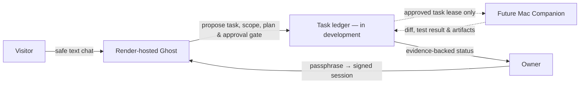

# Ghost — Approval-Gated Personal Coding Coordinator

[](https://ghost-34qz.onrender.com)
[](https://nodejs.org/)
[](LICENSE)

**Ghost is a personal AI coding-assistant project built around one rule: it should never pretend that it executed work it cannot prove.** It is being developed as a **Render-first coordinator**: the hosted web app provides visitor-safe assistance and an owner-only workspace, while any future coding work on a personal machine must be explicitly approved, isolated, and accompanied by verifiable evidence.

> **Current status — active development.** The public web app is a portfolio preview and safe chat surface. The approval-gated local coding workflow is being built in stages and is **not yet a live autonomous execution service**.

## Why this project exists

Many “autonomous agent” demonstrations blur planning, tool access, and completed actions. Ghost takes the opposite approach. It separates a helpful public-facing chat experience from privileged owner workflows, then requires a visible plan, a bounded scope, approval, and evidence before any local code change can be treated as complete.

The result is intended to demonstrate practical engineering decisions rather than AI-execution theater: authentication boundaries, explicit failure states, safe task lifecycle design, and deployment-aware architecture.

## Product boundaries

| Surface | Intended experience | Current boundary |
|---|---|---|
| **Visitor mode** | Ask about the project and have a safe text conversation. | Visitors must not receive private project memory, shell, filesystem, database, email, browser, or coding-worker access. |
| **Owner mode** | Authenticate to access private workspace features and future coding-task controls. | Owner authentication is handled server-side with a signed session cookie or Bearer token; privileged features remain gated. [1] |
| **Hosted Render service** | Coordinate requests, show status, and host the user interface. | It cannot reach a personal Mac through `127.0.0.1` and must not claim that it can. |
| **Future Mac Companion** | Receive only approved tasks, work in an isolated worktree, run one approved test, and return evidence. | This outbound, approval-gated workflow is not yet wired into the public deployment. |

### What Ghost does **not** claim today

Ghost does **not** currently claim that it can autonomously edit a repository, create downloadable files, control a personal computer, make phone calls, read email, operate a browser, or execute a local command from Render. A legacy local-runner script exists in the repository, but it is not evidence of a deployable Render-to-Mac connection and is not presented as a live product capability. [2]

The project also does not claim user counts, benchmark percentages, latency records, security certification, multi-tenant isolation, or production-ready autonomous execution without reproducible evidence.

## Architecture direction



The deliberate boundary is the point of the design: **planning is not execution**. A hosted coordinator cannot safely or truthfully represent a local action as completed unless an approved worker returns matching evidence.

## Engineering focus

Ghost currently concentrates on the following engineering areas.

| Area | Evidence in this repository |
|---|---|
| **Web application** | Node.js and Express server with a browser-based user interface. [3] |
| **Owner authentication** | Server-side login and session verification using `ghost_session` or an Authorization header. [1] |
| **Deployment configuration** | Environment-driven local/public modes and a Render homepage are declared in the project configuration. [3] [4] |
| **AI-provider integration** | Environment template includes optional provider configuration; keys are never committed. [4] |
| **Safety-oriented coding roadmap** | Future work is constrained to approved repositories, isolated worktrees, explicit task scope, one approved test command, and evidence before acceptance. |

## Run locally

Ghost requires Node.js 20 or newer. Copy the environment template and provide only the services you intend to configure; never commit your `.env` file or API keys. The template lists the available configuration names. [4]

```bash
git clone https://github.com/Manojkumar7671/Ghost.git
cd Ghost
npm install
cp .env.example .env
# Edit .env locally. At minimum, set a strong ADMIN_PASSPHRASE and JWT_SECRET.
npm start
```

Then open `http://localhost:3000`. Do not expose a local runner to the internet or configure personal-device automation from the public deployment.

## Verification status

The repository contains focused test files under [`tests/`](./tests/), but the public main branch is currently undergoing test-suite consolidation. Its `npm test` entry points to a missing `scripts/test-runner.js`, so it must **not** be presented as a green, one-command CI baseline. [3] [5]

Work is considered ready to promote only when the exact changed behavior has a reproducible command, its literal output is recorded, and any coding-worker path proves all of the following:

1. The request came from an authenticated owner.
2. The approved plan, repository, paths, and test command match the task.
3. The worker lease is current and cancellation has not won the race.
4. The reported file changes and successful test output are returned as evidence.

## Roadmap

| Stage | Outcome |
|---|---|
| **1. Truthful public product** | Visitor-name onboarding, readable Graphite Operator UI, explicit owner unlock, and no false tool or file-creation claims. |
| **2. Approval-gated coding workflow** | Owner task ledger, immutable approval manifest, outbound Companion heartbeat, isolated worktrees, and evidence-based completion. |
| **3. Personal-assistant extensions** | Narrow, owner-only research, email, app, browser, and memory capabilities with action previews, audit trails, and explicit confirmation gates. |

## Portfolio note

Ghost is a work-in-progress engineering case study, not a claim of general autonomy. The project is most useful to reviewers as evidence of how Manojkumar approaches **system boundaries, reliability, verification, and responsible AI-product design**.

## References

[1]: ./server.js#L375-L458 "Server-side session handling and login"
[2]: ./scripts/runner.js "Legacy local Companion runner; not a Render-to-Mac service"
[3]: ./package.json "Project scripts, Node.js version, and dependencies"
[4]: ./.env.example "Local environment configuration template"
[5]: ./tests "Current public test files"

## License

This project is licensed under the [MIT License](LICENSE).
